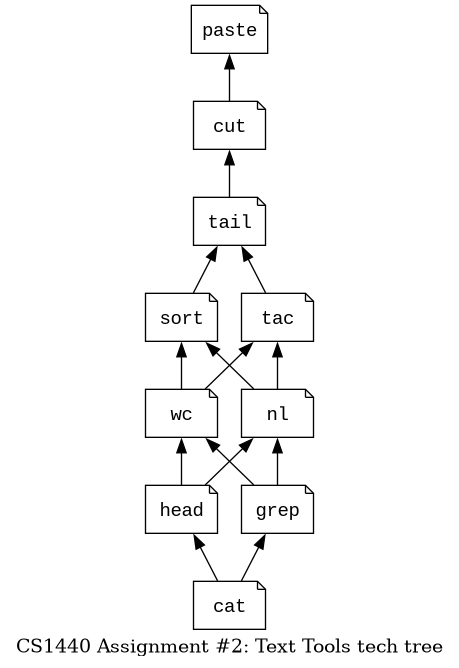

# CS 1440 Project 2: Text Tools - Instructions

**You may use AI tools** such as ChatGPT or GitHub Copilot to assist with code and documentation

*   If you do this, explain in your Software Development Plan *which* tools were used, *where* they were used, and *how* they were used
*   Use comments to *clearly* identify which portions of source code were written by the tool
*   Failure to document use of these tools will be regarded as a **violation of academic integrity** and I will pursue sanctions
    *   The same applies to any other resources from outside the class


Previous Semester Statistics     | Fall 2023 | Spring 2024 | Fall 2024
--------------------------------:|:---------:|:-----------:|:---------:
Average Hours Spent              | 14.33     | 12.23       | 12.9
Standard Deviation Hours         | 6.779     | 5.533       | 5.52
% students thought this was Easy | 11.1%     | 10.2%       | 9.0%
... Medium                       | 44.4%     | 47.7%       | 51.3%
... Hard                         | 37.0%     | 27.3%       | 28.2%
... Too Hard/Did not complete    | 7.4%      | 14.8%       | 11.5%


*   [How to Do This Project](#how-to-do-this-project)
    *   [Phase 0: Requirements Analysis](#phase-0-requirements-analysis)
    *   [Phase 1: Design](#phase-1-design)
    *   [Phase 2: Implementation](#phase-2-implementation)
    *   [Phase 3: Testing and Debugging](#phase-3-testing-and-debugging)
    *   [Phase 4: Deployment](#phase-4-deployment)
    *   [Phase 5: Maintenance](#phase-5-maintenance)
*   [What We Look for When Grading](#what-we-look-for-when-grading)


## How To Do This Project

The skeleton of this program has been provided to you.  Unfortunately, your boss did not follow his own advice and failed to write a Software Development Plan.  He will never admit it, but this is why he gave up and handed the project to you.  Don't make the same mistake!

In this project you will run through the Software Development Process multiple times:

0.  Once in its entirety for the **overall** project
1.  Nine times from Phase 0 *Requirements Analysis* through Phase 3 *Testing and Debugging* for each tool you are required to write (the `cat` tool will be demonstrated in class and does not count).

This means that for each tool you will write a new Software Plan.  The tools are meant to be completed one at a time to give you practice with this process.  They are pretty easy to write if you do them in the right order.  This is a map of all recommended orders; if you get stuck on one tool, choose another path and come back to that tool later.



*   In the instructions that follow, steps that pertain to the overall project and the files `src/tt.py` and `src/Usage.py` are marked **OVERALL**.
    *   Document your work in phases 0-3 of `src/tt.py` in the file `doc/Plan-tt.md`.
    *   Write up phases 4 & 5 for the whole project in this file as well.
*   Steps that should be repeated for each tool are marked **TOOL**.
    *   Write phases 0-3 for each individual text tool in their own plan files.


### Phase 0: Requirements Analysis
*(20% of your effort)*

**Important - do not change any code in this phase**

0.  **OVERALL** Read the [Project Requirements](./Project_Requirements.md) to orient yourself with the project.
1.  **TOOL** Read the [Output Examples](./examples/) to learn what each tool should do.
    *   Understand what kind of output each tool makes when given *good inputs*.
    *   Understand what sorts of errors can happen when the tools are given *bad inputs*.
2.  **OVERALL** Study the [Usage module](../src/Usage.py)
    *   It will help you understand the difference between *good* and *bad* inputs.
    *   Fortunately, this module is *complete* and *does not* require any changes from you.
    *   Use the REPL to learn how it works.  For example:
        *   ```
            $ python -i src/Usage.py
            >>> usage()
            Python Text Tools Usage:
            ========================
            ...

            >>> usage("An error message", "tac")
            Error: An error message

                tt.py cat|tac FILENAME...
                Concatenate and print files in order or in reverse
            ```
3.  **OVERALL** **Do not change the source code in this phase of the project!**
    *   You will edit code in **Phase 2: Implementation**.
    *   In this phase your task is to *draft* the plan that you will follow when you get there.
4.  **OVERALL** Take the **Starter Code Quiz** on Canvas.
    *   Do not worry if you can't answer all of the questions yet
    *   You can re-take the quiz as many times as you want before the project is due
5.  **OVERALL** Fill out **Phase 0** in Plan-tt.md; explain in your *own words* what the program does, how it does it, and what changes you expect to make.
6.  **OVERALL** Track your time in Signature.md.


### Phase 1: Design
*(30% of your effort)*

**Important - do not change any code in this phase**

1.  **TOOL** Design tool functions on paper; **don't rewrite the Python code yet**.
    *   In this phase sketch them out in *pseudocode*.
    *   Walk through the pseudocode in your head, with a pad of paper or a whiteboard to convince yourself that your design will work.
2.  **TOOL** Write signatures and pseudocode for each tool in its respective Plan.md.
    *   *Hint:* You do not need to write a signature or pseudocode for `Usage.usage()`; it has already been designed.
    *   *Hint:* The signature of each tool function found in the starter code is already good enough.
    *   Do not paste Python code into your plan documents; when we want to see your code we will read the `.py` files.
3.  **TOOL** You may write *some* runnable Python code to test out your ideas.
    *   This is called *prototyping*, and is a normal part of the design process.
    *   Do not become too attached to your prototype!
    *   Be prepared to delete prototype code after this phase.
    *   It helps to *not* write prototype code in the same files as *real* code.
4.  **TOOL** The [Output Examples](./examples) contain lots of good test cases.
    *   If you can think of any new test cases, you should write them down here!
5.  **OVERALL** You should be able to get 100% on the **Starter Code Quiz** by now.
6.  **TOOL** Fill out **Phase 1** in Plan.md.
    *   This will be the longest portion of the document.
7.  **OVERALL** Track your time in Signature.md.


### Phase 2: Implementation
*(15% of your effort)*

**Finally, you can write code!**

0.  **TOOL** By the end of this phase the tool is runnable.
    *   **Do not** move on if your program crashes unexpectedly!
    *   Don't forget to **close all files** your tools use.
1.  **TOOL** Fill out **Phase 2** in the tool's Plan.md.
    *   As you work in this phase you may choose to deviate from the design you settled upon in the previous phase.  This is normal!
    *   Briefly explain what changed.
    *   Do not paste long passages of Python code in Plan.md.
    *   Your write-up for this phase may be very short.
2.  **OVERALL** Track your time in Signature.md.


### Phase 3: Testing and Debugging
*(30% of your effort)*

Your grade depends on how your program performs when run from the command line.  We don't use PyCharm to grade, so ensure your program runs correctly from the shell.

0.  **TOOL** Run through the test cases suggested in the [Output Examples](./examples).
    *   The [Testing Scripts](../testing/README.md) are your friends!
1.  **TOOL** Run through any new test cases that you devised.
2.  **TOOL** Fill out **Phase 3** in the tool's Plan.md.
    *   Describe the test cases you ran.
    *   Make note of the commands that you ran and what happened in the program.
3.  **TOOL** If you found bugs in this phase, explain what was wrong and how you fixed it.
4.  **OVERALL** Track your time in Signature.md.


### Phase 4: Deployment
*(5% of your effort)*

It is your responsibility to ensure that your program will work on your grader's computer.

*   Code that crashes and *cannot* be quickly fixed by the grader will receive **0 points** on the relevant portions of the rubric.
*   Code that crashes but *can* be quickly fixed by the grader (or crashes only *some* of the time) will receive, at most, **half-credit** on the relevant portions of the rubric.

The following procedure is the best way for you to know what it will be like when the grader runs your code:

0.  **OVERALL** Review [How to Submit this Project](./How_To_Submit.md) and make sure that your submission is correct.
1.  **OVERALL** Push your code to GitLab, then check that all of your files and commits appear there.
2.  **OVERALL** Clone your project into a *different directory*, and re-run your test cases.


### Phase 5: Maintenance

**Before The Due Date**

0.  **OVERALL** Review each Plan.md and Signature.md one last time.
1.  **OVERALL** Fill out **Phase 5** in Plan-tt.md by answering the questions.
2.  **OVERALL** Make one final commit and push your **completed** Software Development Plan and Signature to GitLab.
3.  **OVERALL** Make sure that you are happy with your **Starter Code Quiz** score.

**After You Submit (Can Happen After The Due Date)**

0.  Respond to the **Project Reflection Survey** on Canvas.


## What We Look for When Grading

**Total points: 100**

*   Repository Structure (10 points)
    *   The repository is a clone of the starter code
    *   The repository's GitLab URL follows the naming convention
    *   All required files and directories are in their expected locations
    *   `.gitignore` is correct and no forbidden files or directories are present
    *   There is at least one Git commit per tool
*   Quality documentation (35 points)
    *   Each tool's Software Plan is filled out
        *   Each section is filled out with a convincing level of detail
        *   No code is pasted from the source files
    *   Plan-tt.md is filled out
*   Time management (5 points)
    *   Signature.md contains accurate information about the time you spent on this project
        *   The time reported on the **TOTAL** entry is the sum of the daily entries
    *   The *TODO* message and the placeholder entries have been removed
*   Code Quality (20 points)
    *   Doc strings and comments match the code they describe
    *   Functions are organized into the correct modules
    *   No useless variables or constants are present
    *   No useless import statements are present
    *   No extraneous print statements are left in the code (i.e. all of the `print("TODO: ...")` lines are deleted OR send output to STDERR)
    *   Program *does not* import any modules **except**:
        *   `sys`
        *   `typing`
        *   modules provided by the starter code
        *   modules you wrote yourself
    *   No import statement fails due to misspelling or incorrect capitalization.
        *   **Windows users** make sure that the capitalization of file names on GitLab match your `import` statements!
    *   No imports involve the `src.` package; this is the result of a PyCharm misconfiguration
    *   `sys.argv` is directly accessed only in `tt.py`
        *   Relevant portions of the command line are passed into each tool function
    *   `eval()` or similar functions must not be used; use `int()` to convert strings into numbers
    *   Data files are closed in ordinary situations
        *   In the event of an error, your program will display an error message and immediately exit without closing files
*   Program Behavior (30 points)
    *   User Interface meets requirements
        *   Command line options are appropriately handled
        *   When incorrect user input is detected, the `Usage.usage()` function is called to display an appropriate error message and exit the program
    *   Program doesn't crash unexpectedly
        *   Exception handling is **not** employed
        *   Python's default error message appears when `open()` fails
        *   `ValueError`, `IndexError` and similar issues do not occur
    *   Output is reasonably close to the examples
        *   *Small* differences in white space and formatting are tolerated
        *   Extra blank lines, duplicated lines, missing or extra commas *are not* small differences
    *   No external programs are called to do the work
        *   Do not use `os.system()`, `subprocess`, `pipes` or similar features.
        *   This is a pure Python program, not a shell script that leverages external programs.
    *   The program completely relies on user input to locate files
        *   Hard-coded paths are not written into the program
        *   All of the tools will work no matter what directory the program is started from
